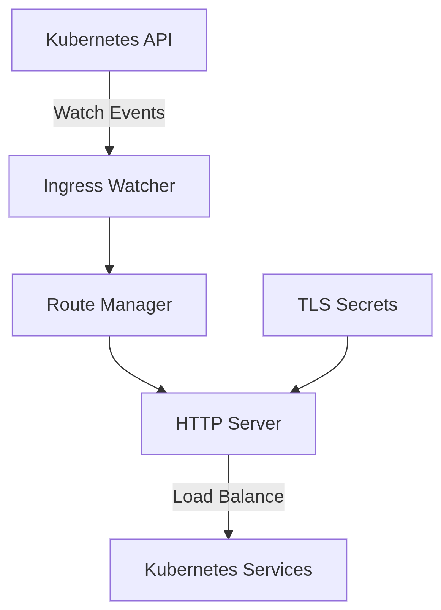

# 🚀 Elixir Ingress Controller

**A Kubernetes Ingress Controller implementation in Elixir**  
[](https://opensource.org/licenses/MIT)
[](https://elixir-lang.org/)

A lightweight and extensible Kubernetes Ingress Controller built with Elixir, designed to maximum concurrency and fault tolerance features.

---

## 🌟 Features

- **Kubernetes Ingress Spec Compliance**  
  Supports `host`, `path`, `pathType` (Prefix/Exact), and TLS termination.
  
- **Dynamic Configuration**  
  Watches Kubernetes API for real-time Ingress resource updates.

- **TLS Termination**  
  Automatically loads certificates from Kubernetes Secrets.

- **Service Discovery**  
  Integrates with Kubernetes Services and Endpoints for load balancing.

- **Extensible Design**  
  Easily add middleware for auth, rate limiting, or custom routing logic.

---

## 🛠️ Getting Started

### Prerequisites

- Kubernetes cluster (Minikube, Kind, or cloud-based)
- `kubectl` configured for cluster access

### Installation

TODO

---

## 🚦 Usage

Example Ingress Resource

```yaml
apiVersion: networking.k8s.io/v1
kind: Ingress
metadata:
  name: demo-ingress
  annotations:
    waiter-controller/rate-limit: "1000r/s"
    waiter-controller/cors-origins: "https://your-domain.com"
spec:
  tls:
  - hosts:
      - example.com
    secretName: example-tls
  rules:
  - host: example.com
    http:
      paths:
      - path: /api
        pathType: Prefix
        backend:
          service:
            name: api-service
            port:
              number: 8080
``` 

---

## 🧩 Architecture


